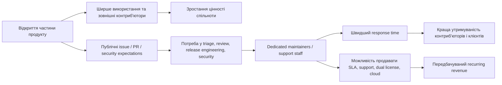

# Використання open-source у підприємствах

## Виконавче резюме

Open-source уже став стандартною частиною корпоративного стеку. За даними Linux Foundation, open source має суттєве проникнення в ядро enterprise-інфраструктури: операційні системи використовують 55% опитаних, cloud/container-технології — 49%, web/app development — 46%, бази даних і data management — 45%, DevOps — 45%, AI/ML — 40%. У Black Duck OSSRA 2026 open source виявлено у 98% перевірених кодових баз, середня кількість OSS-компонентів на застосунок зросла до 1,180, а понад 90% кодових баз уже мають значний maintenance debt. Це означає, що питання вже полягає не в тому, чи використовувати OSS, а в тому, як ним управляти, як фінансувати його підтримку і як зменшувати технічний борг навколо нього. citeturn18view0turn19view3turn19view5

Для бізнес-кейсу відкриття частини продукту ключовий висновок такий: моделі на пожертвах майже ніколи не дають достатньо передбачуваного доходу для гарантованої підтримки, якщо проєкт не має вже сформованої аудиторії або бренду. GitHub Sponsors у дослідженнях показує сильний long tail: менш ніж 40% розробників, які активували профіль, взагалі отримують донати. В Open Collective лише 26.61% проєктів отримують пожертви, і 64.38% із профінансованих збирають менш ніж $50,000 сумарно. Натомість комерційні моделі на кшталт dual licensing, paid support, consulting і managed/cloud-версії краще відповідають вимозі мати окремий support staff, бо дають регулярний B2B-дохід. Це добре узгоджується з опитуванням Tidelift: 81% мейнтейнерів віддають перевагу саме передбачуваному щомісячному доходу. citeturn14search9turn13view2turn15view0turn15view4

Підприємства несуть помітні внутрішні витрати навколо OSS, навіть коли сам код безкоштовний. У середньому організація з дослідження Linux Foundation підтримує 86 приватних форків OSS-компонентів; на один форк іде в середньому 60 людино-годин за release cycle, разом 5,160 людино-годин на цикл. Для великих компаній вибірка показує 136 приватних форків і 11,152 людино-годин на цикл. Через невідповідність roadmap’ів бізнес-потребам 36% організацій регулярно мають затримки у продакшені через відсутні фічі або фікси, а середня вартість workarounds становить $670,000 на рік. Це створює дуже сильний аргумент на користь upstream contribution, власного OSPO або щонайменше оплачуваної участі в критичних залежностях. citeturn40view0turn41view4

Швидкість реакції в OSS має широкий розкид. У вибірці з 111,094 pull requests у десяти зрілих популярних OSS-проєктах 80.16% PR отримували першу відповідь менш ніж за день, 93.01% — менш ніж за тиждень, а 43%–83% PR одержували першу людську відповідь ще в межах 8-годинного робочого дня. Водночас для security fixes картина значно інерційніша: у дослідженні npm-пакетів 50% вразливостей фіксилися протягом місяця після виявлення, 74% — протягом шести місяців, і 17.4% лишалися невиправленими навіть через 12 місяців; для залежних пакетів 50% виправлень займали майже 14 місяців. Тому enterprise-SLA і community response — це різні рівні сервісу, які мають різну собівартість. citeturn8view2turn8view0turn9view0

Для junior-розробників OSS дає реальний ефект зростання, якщо є менторинг і швидкий review loop. Linux Foundation повідомляє, що 99% випускників LFX Mentorship вважали програму корисною, 69% побачили кар’єрне просування, 47% кажуть, що програма допомогла отримати роботу, 67% працевлаштованих відзначили зростання доходу, а 85% продовжують або готові продовжувати вкладатися в проєкт після програми. Водночас менторинг потребує окремого ресурсу: Apache оцінює типове навантаження ментора в 3–5 годин на тиждень на студента, Outreachy — 5–10 годин на тиждень у contribution period і 5 годин на тиждень під час самої internship-фази. Для компанії це означає, що розвиток джунів через OSS має сенс, якщо менторинг бюджетовано як окрема функція, а не як невидима «додаткова» робота. citeturn25view0turn27search12turn27search6

## Як підприємства впроваджують OSS у продукти й сервіси

Open source у корпоративному середовищі використовується у двох базових режимах: як готовий залежний компонент і як основа для модифікованого чи комерціалізованого продукту. Linux Foundation у ROI Survey 2025 показує, що 68% організацій зазвичай використовують OSS-компоненти «як є», 49% роблять upstream-внески, 45% форкають OSS-проєкти й підтримують внутрішні версії, 28% наймають зовнішніх консультантів для upstream contribution, а 26% беруть участь у governance або decision-making OSS-проєктів. Тобто типовий enterprise-патерн вже включає одночасно споживання, локальні модифікації та участь у спільноті. citeturn16view0

З боку економіки залежність бізнесу від OSS вже давно вийшла на системний рівень. Гарвардське дослідження вартості widely-used OSS оцінює demand-side value у $8.8 трлн і показує, що фірмам довелося б витрачати в 3.5 раза більше на софт, якби цього коду не існувало. При цьому 96% цього використаного value створюють лише 5% розробників. Для компанії, яка планує відкрити частину свого продукту, це важливий сигнал: найвища економічна цінність концентрується в обмеженому числі критичних build blocks, і саме навколо таких блоків найкраще працюють моделі paid support, managed offerings і ecosystem funding. citeturn18view3

Практика enterprise-інтеграції все частіше оформлюється через OSPO. Linux Foundation у State of OSPOs 2025 описує OSPO як хаб для security governance, compliance і бізнес-стратегії. Організації з OSPO майже вдвічі частіше заохочують open-source contributions, ніж організації без OSPO: 59% проти 30%. 89% організацій також вказують на покращення developer experience через OSPO-ініціативи. Для компанії, яка хоче відкрити частину продукту, це означає, що open source має працювати як керована функція з політиками, метриками і відповідальними ролями, а не як побічна активність окремих інженерів. citeturn20view2turn20view4

Окремо варто зафіксувати, що adoption сам по собі не розв’язує governance-проблему. Linux Foundation Global Open Source 2025 прямо говорить про «mission-critical status» OSS в enterprise stack за наявності непослідовного управління. Black Duck OSSRA 2026 додає, що середня audited codebase містить 1,180 OSS-компонентів, 581 вразливість, а 92% кодових баз мають компоненти, застарілі щонайменше на чотири роки, і 93% — компоненти без жодної активності розробки за два роки. Для продукту, який ви плануєте частково відкрити, це означає, що відкриття коду саме по собі ще не створює здоровий ecosystem loop; потрібні release discipline, security policy, SBOM, ownership і механізм прийняття зовнішніх внесків. citeturn18view0turn19view0turn19view2turn19view3

## Монетизація OSS для мейнтейнерів і малих команд

Найстабільніший загальний висновок з досліджень та платформ такий: доходи від чистих донатів мають дуже нерівномірний розподіл. GitHub Sponsors у дослідженні 2022 року і follow-up 2024 року показує, що з приблизно 9,000 розробників, які активували GitHub Sponsors, менш ніж 40% отримали хоча б одне фінансування. Інше емпіричне дослідження називає ще жорсткішу цифру: близько 31% розробників у механізмі GitHub Sponsors реально отримують винагороду. Для Open Collective дослідження 2025 року показує, що лише 26.61% OSS-проєктів отримують пожертви; серед профінансованих 64.38% зібрали менш ніж $50,000 сукупно, а основна маса транзакцій концентрується у діапазоні $5–$10. Це означає, що для більшості соло-мейнтейнерів і маленьких команд «базовий» результат donation-моделі — дуже низький дохід або нуль. citeturn14search9turn12search8turn13view2

Водночас донати можуть працювати як канал pre-product monetization, якщо вже є аудиторія і сильний distribution loop. Caleb Porzio описав публічний кейс sponsorware: до запуску він мав 23 sponsors і $573/місяць на GitHub Sponsors; після анонсу sponsorware-моделі — 75 sponsors і $1,560/місяць, а на момент написання — 101 sponsor і $2,633/місяць. Це хороший реальний приклад для індивідуального мейнтейнера, водночас сам автор прямо описує його як contingent outcome, пов’язаний із уже наявною аудиторією, newsletter і consulting perks у higher tiers. Як benchmark для бізнес-плану це радше показує верхню межу успішного соло-кейсу на донатах, ніж типовий результат. citeturn39view0

На рівні платформ інфраструктура для монетизації вже достатньо зріла. GitHub Sponsors не бере комісію з sponsorships від персональних акаунтів, а з організаційних бере до 6%; GitHub також повідомляє про $40M+ повернених мейнтейнерам на своїй публічній сторінці, а Stripe у кейсі GitHub вже фіксує $60M+ інвестицій від фізичних осіб та організацій і 5,800+ організацій-спонсорів. Open Source Collective повідомляє, що в 2024 році виплати мейнтейнерам сягнули $9.7M, а загалом з 2017 року через платформу пройшло понад $50M. Для GitHub Sponsors це показує реальний масштаб попиту на sponsorship, для Open Collective — реальний масштаб інфраструктури витрат і прозорих payout’ів. citeturn37search0turn37search3turn13view4turn13view5

Комерційні моделі для open-source частини продукту значно краще підходять під вимогу «потрібен dedicated support staff». Dual licensing і commercial edition мають публічні ринкові орієнтири: MySQL Enterprise Edition коштує $5,350 на сервер на рік для 1–4 socket server, MySQL Standard Edition — $2,140 на сервер на рік; Qt має публічні subscription prices на рівні $4,660/рік для Qt for Application Development Enterprise і $7,610/рік для Qt for Device Creation Professional. Ці цифри походять від зрілих vendor-backed OSS/dual-license компаній, тож для невеликої команди їх варто трактувати як upper-mid benchmark B2B willingness to pay за critical tooling, support і додаткові права використання. citeturn38search8turn38search0turn38search7

Paid support і consulting ближчі до того, як enterprise реально купує надійність. OpenLogic просуває 24/7/365 support з гарантованими SLA для 400+ технологій; Red Hat Premium Support публікує initial response для Severity 1 на рівні 1 години і для Severity 2 — 2 годин; Canonical описує 24/7 human-in-the-loop technical support і response windows до 1–2 годин для найвищих пріоритетів у відповідних support tiers. Це формує важливий висновок для вашого бізнес-кейсу: якщо ви обіцяєте enterprise-support, ринок порівнюватиме вас з годинними response targets і 24/7 coverage, а не з типовою швидкістю спільнотного issue tracker. citeturn28search2turn28search4turn28search1turn28search5

### Порівняння моделей монетизації

| Модель                              | Що купує клієнт                                                   | Що кажуть дані про типовий дохід                                                                                                          | Передбачуваність | Практичний висновок для малої команди                                                                                              | Джерела                                          |
| ----------------------------------- | ----------------------------------------------------------------- | ----------------------------------------------------------------------------------------------------------------------------------------- | ---------------- | ---------------------------------------------------------------------------------------------------------------------------------- | ------------------------------------------------ |
| GitHub Sponsors                     | goodwill, ранній доступ, perks, бренд автора                      | Менш ніж 40% активованих профілів узагалі отримують донати; публічний соло-кейс sponsorware показав ~$1.6k/міс, пізніше ~$2.6k/міс.       | Низька–середня   | Добре для seed funding і community goodwill. Слабка база для SLA-staffing без уже великої аудиторії.                               | citeturn14search9turn39view0turn37search0   |
| Open Collective / OSC               | donations, transparent budget, expense payouts                    | Лише 26.61% проєктів отримують пожертви; 64.38% профінансованих проєктів мають менш ніж $50k total; більшість донатів у діапазоні $5–$10. | Низька–середня   | Сильний інструмент прозорості та payout-операцій. Фінансує хобі- і semi-pro-рівень, рідше — окрему support-команду.                | citeturn13view2turn13view5turn37search13    |
| Patreon                             | recurring fan support, контент, community                         | Для OSS є data gap щодо типових доходів; платформа бере 10% плюс processing/FX/payout fees.                                               | Середня          | Працює, якщо є creator/community angle. Для B2B OSS підходить рідше, ніж Sponsors або support contracts.                           | citeturn37search2turn37search5               |
| Dual licensing / commercial edition | додаткові права, compliance, довша підтримка, enterprise features | Публічні upper-mid benchmarks: MySQL EE $5,350/server/year; Qt $4,660–$7,610/year.                                                        | Висока           | Найсильніша модель, якщо ваш продукт є business-critical component і має чітку межу між open core та paid rights/features/support. | citeturn38search8turn38search0turn38search7 |
| Support / consulting / managed help | швидке вирішення інцидентів, advice, migration, patching          | Enterprise open-source ринок уже очікує SLA-рівень 1–2 години для highest severity у преміальних програмах.                               | Висока           | Найпряміший шлях до justified support headcount. Добре працює для infra/devtools/database/security-компонентів.                    | citeturn28search2turn28search4turn28search1 |

### Що це означає для доходу маленької команди

Якщо виходити з опублікованих dual-license benchmarks, один контракт масштабу MySQL EE дає $5,350/рік, один контракт масштабу Qt — приблизно $4,660–$7,610/рік. Отже, 20 контрактів на рівні $7,610 дають близько $152,200/рік; 25 контрактів на рівні $5,350 дають близько $133,750/рік. Це вже співмірно з бюджетом на одного повноцінного support/maintainer engineer у Європі або змішаній EU/nearshore команді, якщо брати як відправну точку медіанний глобальний developer pay у $50/годину, який Linux Foundation використала у своїх ROI-розрахунках. Це є аналітичним розрахунком на базі публічних benchmark-цін і явного припущення, що ваш продукт продається в тому самому порядку цін. citeturn38search8turn38search0turn40view0

Для donation-first моделі арифметика набагато жорсткіша. Публічний sponsorware-кейс на рівні $1.6k–$2.6k/місяць дає приблизно $18.7k–$31.6k на рік. Це відчутно допомагає соло-автору або part-time maintenance, проте окрему support function для enterprise він фінансує лише частково. Тому для продукту, де вам потрібні dedicated support staff, donation layer краще сприймати як supplementary revenue, а recurring B2B contracts — як основне джерело покриття персоналу. citeturn39view0turn15view4

## Швидкість реакції, оновлень і SLA

Швидкість підтримки в OSS залежить насамперед від зрілості проєкту, числа maintainers, ролі ботів, release discipline і наявності оплачених людей у контурі. У великому дослідженні 111,094 pull requests з десяти популярних mature OSS-проєктів на GitHub 80.16% PR отримали universal first response менш ніж за день, 68.36% — в межах 8-годинного робочого дня, 93.01% — менш ніж за тиждень. Для popular projects median time-to-universal-first-response варіювався від 0.08 до 86.65 хвилини, за винятком Odoo з 1,413.17 хвилини. Також 43%–83% PR у цих проєктах отримували першу людську відповідь ще в межах одного робочого дня. Це хороший benchmark для top-tier community health. citeturn8view2turn8view0

При цьому швидкі bot responses не дорівнюють реальній support responsiveness. Те саме дослідження показує, що в половині розглянутих проєктів median bot-first response був меншим за 10 хвилин, у Node — 0.03 хвилини, Rails — 0.05, Discourse — 0.08, Kubernetes — 0.12. Водночас human-first-response істотно повільніший, а наявність бота не гарантує швидший follow-up людини. Для enterprise це означає, що автоматичний triage покращує perceived responsiveness, проте не замінює оплачені години reviewer’ів і maintainers. citeturn8view0

Швидкість випуску security fix’ів також має суттєвий розкид. У дослідженні security releases автори знаходять median lag між уже наявним кодовим fix і security release на рівні 4 днів. У дослідженні npm ecosystem 50% вразливостей були виправлені протягом місяця після виявлення, 74% — протягом шести місяців, і 17.4% залишались невиправленими через рік. Для dependent packages ситуація повільніша: 50% upstream packages фіксилися протягом місяця, для dependents цей показник був 33.1%, а до 50% виправлених залежних пакетів доходило майже 14 місяців. У Maven-дослідженні 2025 року популярність бібліотеки та частіший version release positively впливали на швидкість усунення вразливостей. citeturn5search9turn9view0turn7view4

Release cadence теж сильно відрізняється між проєктами. У вибірці понад 8,000 GitHub projects лише 13% мали rapid release cadence з інтервалом менш як 30 днів. Водночас окремі відомі OSS-системи публічно працюють з досить чіткими cadence-патернами: Argo CD випускає minor release раз на три місяці, OpenSearch у 2026 році планував перейти на 9-тижневу cadence після практики 8-тижневої, а Typesense описує RC-релізи кожні 1–2 тижні. Для бізнес-кейсу це означає, що популярний і «живий» OSS-проєкт цілком може мати release intervals від 1–2 тижнів до кварталу; натомість велика частина OSS-ландшафту оновлюється повільніше, і саме звідси з’являються форки, backports і vendor support opportunities. citeturn30search5turn32search23turn32search8turn32search11

### Порівняння community responsiveness і enterprise SLA

| Показник                            | Типовий community benchmark                                                                                                          | Enterprise support benchmark                                                                                        | Джерела                                                          |
| ----------------------------------- | ------------------------------------------------------------------------------------------------------------------------------------ | ------------------------------------------------------------------------------------------------------------------- | ---------------------------------------------------------------- |
| Перша відповідь на PR / issue       | 80.16% PR отримують першу відповідь < 1 дня; 93.01% < 1 тижня; у popular projects median може бути від секунд до годин.              | У paid support найвищі severity зазвичай мають response target 1–2 години.                                          | citeturn8view2turn28search4turn28search1                    |
| Перша людська реакція               | 43%–83% PR у popular OSS отримують першу людську відповідь у межах 8-годинного дня.                                                  | 24/7 premium contracts у Red Hat / Canonical орієнтуються на безперервну або годинну реакцію для critical cases.    | citeturn8view0turn28search4turn28search1                    |
| Security release після готового fix | Median 4 дні.                                                                                                                        | Commercial vendors often bundle fix verification, packaging, advisories і backports під SLA.                        | citeturn5search9turn28search2                                |
| Виправлення вразливостей upstream   | 50% npm vulnerabilities fixed within 1 month; 74% within 6 months.                                                                   | Enterprise customer зазвичай очікує чіткі escalation paths і backport support набагато швидше цього горизонту.      | citeturn9view0turn28search4                                  |
| Cadence релізів                     | Лише 13% із 8,000 GitHub projects release < 30 днів; на практиці конкретні mature OSS продукти працюють від 1–2 тижнів до 3 місяців. | Paid support часто продає не часті релізи, а predictability, backports, compatibility guidance і incident response. | citeturn30search5turn32search23turn32search11turn28search2 |

Для вашої моделі це дає простий операційний висновок. Якщо обіцяти лише community-style support, ринок отримає нерівномірну швидкість реакції, що ще прийнятно для free tier. Якщо обіцяти enterprise usage у business-critical середовищі, треба будувати окрему support plane: triage, ownership, advisory process, patch backporting, release manager і ротація інцидентів. Без цього комерційна частина пропозиції не матиме чіткої відмінності від звичайного GitHub repo. citeturn28search2turn28search4turn28search1

## Внутрішні витрати часу, форки і внесок назад

Найважливіша кількісна знахідка для enterprise business case — open source майже завжди генерує значний внутрішній «супровідний» обсяг робіт. Linux Foundation оцінює середню організацію у 86 приватних форків OSS-компонентів, по 60 людино-годин на один форк за release cycle, разом 5,160 годин і приблизно $258,000 на цикл за ставки $50/годину. Розподіл за розміром організації дуже показовий: малі компанії мають 7 приватних форків і 147 годин на цикл, середні — 89 форків і 4,984 години, великі — 136 форків і 11,152 години. Це вже достатня величина, щоб розглядати upstream contribution не як альтруїзм, а як інструмент мінімізації технічного боргу. citeturn40view0turn40view2

Додатково ROI Survey показує, що 36% респондентів стикаються з частими production delays через missing features або delayed fixes в OSS-компонентах; серед великих організацій це зростає до 54%. 49% організацій роблять workarounds для функціональності або fix’ів, яких немає в upstream roadmap. Такі workarounds коштують у середньому $670,000 на рік, причому розбивка за розміром бізнесу теж промовиста: $146,000 для малих, $566,000 для середніх і $1.06M для великих організацій. Для компанії, яка відкриває частину продукту, це дуже важливий аргумент у продажах support/subscription: клієнт часто купує не код, а зменшення цих прихованих витрат. citeturn41view4

Разом з тим внесок назад відбувається далеко не автоматично. Linux Foundation показує, що 72% організацій роблять внесок в open source в ширшому сенсі, включно з документацією, QA, board/SIG work, legal/licensing support і локалізацією. Якщо брати саме code contribution upstream, частка становить 49%. Паралельно 45% підтримують private forks. Це говорить про те, що типовий enterprise стан — змішаний режим: частина workarounds іде в локальний код, частина — у публічний upstream. Для вашого бізнес-плану це означає, що відкрита частина продукту має бути спроєктована так, щоб upstream-iнг був дешевший за приватне відгалуження. citeturn16view0

Історичні case studies це підтверджують. У Linux Kernel і GCC зовнішні організації вносили більшість коду, проте рідко брали участь у bug triaging. В іншому case study вісім обраних компаній забезпечили 17.9% усіх code commits у Linux Kernel за період дослідження, маючи 12.2% code authors; водночас лише 7.7% bug cases мали вклад цих компаній, а компаніям належали лише 2.2% учасників bug reports. Ця асиметрія важлива: фірми охоче фінансують функції та код, значно рідше — triage, onboarding і community support. Саме тут виникає дефіцит, який можна перетворити на комерційну підтримку. citeturn35view2turn35view1

Ще один корисний benchmark: приблизно 50% усього open-source development у великій вибірці вже багато років є оплаченою роботою, причому чимало малих проєктів цілком фінансуються компаніями. Отже, paid labor в OSS — звичайна практика, а не виняток. Якщо ви відкриваєте продукт і розраховуєте на те, що «спільнота сама все потягне», дані радять планувати інакше: критичні безпекові, release і support-функції зазвичай закриваються саме оплачуваними людьми. citeturn35view0

### Таблиця витрат часу та contribution rates

| Метрика                                                             |                                      Значення | Джерело            |
| ------------------------------------------------------------------- | --------------------------------------------: | ------------------ |
| Організації, що використовують OSS as-is                            |                                           68% | citeturn16view0 |
| Організації, що роблять upstream code contributions                 |                                           49% | citeturn16view0 |
| Організації, що підтримують private forks                           |                                           45% | citeturn16view0 |
| Організації, що залучають зовнішніх консультантів для upstream work |                                           28% | citeturn16view0 |
| Організації, що беруть участь у governance OSS-проєктів             |                                           26% | citeturn16view0 |
| Середній обсяг private forks на організацію                         |                                            86 | citeturn40view0 |
| Середні години на 1 private fork за release cycle                   |                                       60 год. | citeturn40view0 |
| Сумарні години на private forks за release cycle                    |                                    5,160 год. | citeturn40view0 |
| Мала організація: total fork maintenance за release cycle           |                                      147 год. | citeturn40view0 |
| Середня організація: total fork maintenance за release cycle        |                                    4,984 год. | citeturn40view0 |
| Велика організація: total fork maintenance за release cycle         |                                   11,152 год. | citeturn40view0 |
| Часті production delays через missing features/fixes                |                         36% усіх; 54% великих | citeturn41view4 |
| Середня вартість workarounds на рік                                 |                                         $670k | citeturn41view4 |
| Розподіл витрат на contribution                                     | code 38%, community 32%, direct financial 31% | citeturn41view0 |
| Середній річний обсяг code contribution                             |                                   69,750 год. | citeturn41view0 |
| Середній річний обсяг community contribution                        |                                   85,000 год. | citeturn41view0 |

## Вплив на розвиток junior-розробників і менторство

OSS є добре придатним середовищем для розвитку junior- та early-career engineers, бо поєднує код, процес, review, документацію і комунікацію в одному просторі. Linux Foundation в дослідженні про mentorship повідомляє дуже сильні результати для mentees: 99% випускників LFX Mentorship вважали участь корисною, 69% побачили кар’єрне просування, 47% сказали, що програма допомогла отримати роботу, 67% працевлаштованих зафіксували збільшення доходу, а 85% є або готові бути контриб’юторами проєкту після завершення менторства. Для компанії це означає, що OSS можна обґрунтовано включати в talent-development strategy, особливо для молодих розробників, platform engineers і security engineers. citeturn25view0

Емпіричні роботи по onboarding показують, що менторинг реально покращує результативність входу в проєкт. У дослідженні з більш як 120 студентами в дев’яти OSS-проєктах автори зафіксували, що розробники, які отримували deliberate onboarding support through mentoring, були активнішими на ранньому етапі. Систематичний огляд mentoring practices в OSS підсумовує 39 primary studies і прямо називає benefits для contributors і проєктів, а також великий набір mentoring challenges. Інше дослідження показує, що expert involvement позитивно корелює з успішністю перших внесків, при цьому надмірне або невдало організоване залучення експертів може негативно впливати на довгострокове retention. Це важлива нюансна точка: менторинг працює, коли є структура, tasks, feedback loop і соціальна підтримка. citeturn23view3turn23view2turn23view4

Один із найсильніших кількісних показників тут пов’язаний зі швидкістю відповіді. У дослідженні pull requests автори показали, що newcomers, які отримали першу людську відповідь протягом одного дня, мали на 2.63%–37.44% вищу ймовірність повернутися з наступним PR; медіанний ефект становив 15.14%. Для existing contributors ефект теж є, хоч і слабший: від 0.06% до 9.48%, медіана 2.25%. Це дає дуже практичний висновок для внутрішнього плану відкриття продукту: staffed reviewer queue — це не косметика, а цілком вимірюваний механізм утримання зовнішніх і молодших контриб’юторів. citeturn8view1

Водночас менторинг має відчутну собівартість. У дослідженні про OSS mentors ментори прямо описують mentorship як time-consuming, згадують overcommitment і difficulty in time-management; автори також показують, що волонтери та менш досвідчені contributors значно рідше беруть на себе роль ментора. Публічні практичні benchmarks це підтверджують: Apache говорить, що більшість менторів витрачає 3–5 годин на тиждень на студента; Outreachy вимагає 5–10 годин на тиждень у період contribution review і 5 годин на тиждень під час тримісячної internship. Тому якщо ви хочете використати відкритий код як канал розвитку junior-розробників, це варто бюджетувати приблизно як 0.1–0.2 FTE менторської уваги на одного активного mentee в інтенсивній фазі. Ця остання оцінка є моїм аналітичним наближенням на базі наведених program benchmarks. citeturn26view1turn26view2turn27search12turn27search6

## Практичний бізнес-кейс для відкриття частини продукту

### Робочі припущення

Нижче я виходжу з консервативного сценарію: ви відкриваєте не весь продукт, а core library / SDK / developer tooling / infra-component, тобто частину, яка має шанс стати залежністю для інших команд і компаній. Команда розробки — 3–8 інженерів. Потенційні клієнти — B2B, середні та великі компанії, для яких важливі compatibility, security advisories, backports, migration help і release predictability. Рівень популярності open-source частини на старті — «відомий у ніші», а не «масовий глобальний стандарт». Це припущення, яке я використовую для інтерпретації benchmarks.

### Рекомендована модель монетизації

Для такого сценарію найкраще працює багаторівнева модель:

1. **Open-source core** як distribution engine і канал adoption.
2. **Commercial support / SLA** як головне джерело регулярного B2B revenue.
3. **Consulting / migration / implementation** як друге джерело cash flow на етапі запуску.
4. **Dual licensing або commercial edition** як опція після появи enterprise-only pain points: compliance, long-term support, proprietary modules, advanced security, HA, auditability.
5. **Sponsors / Open Collective** як supplementary revenue для community-facing work, docs, triage, travel grants, maintainer time.

Дані підтримують таку послідовність. Пожертви розподілені extremely uneven, а maintainers прямо надають перевагу predictable monthly income. Публічні commercial benchmarks дають ціновий коридор у кілька тисяч доларів на рік за server/license even before bespoke consulting. Для критичних enterprise use cases саме support, compliance і response time створюють готовність платити найбільше. citeturn13view2turn15view4turn38search8turn38search0turn28search4

### Який staffing виглядає реалістично

Мінімальний реалістичний контур для відкритої частини продукту, яку хочуть серйозно продавати enterprise-клієнтам, зазвичай включає щонайменше такі ролі:

| Функція                         | Чому потрібна                                                   | Мінімум на старті          |
| ------------------------------- | --------------------------------------------------------------- | -------------------------- |
| Maintainer / reviewer           | PR triage, code review, roadmap, release discipline             | 1 FTE                      |
| Support / solutions engineer    | enterprise tickets, reproductions, integrations, customer comms | 1 FTE або 0.5–1 FTE shared |
| Security / release owner        | advisories, backports, versioning, SBOM, release notes          | 0.5 FTE, часто суміщується |
| Community / developer relations | docs, contribution guides, issue hygiene, newcomer flow         | 0.25–0.5 FTE               |

Це не є прямою цифрою з одного джерела; це синтез із кількох фактів: типові спільнотні response windows різко погіршуються без людської реакції, mentoring і review time мають вимірюваний ресурсний слід, vendors у paid support продають години первинної реакції, а фірми в OSS історично недофінансовують triage та community support порівняно з code output. citeturn8view0turn26view1turn28search4turn35view1turn35view2

### Кількісні орієнтири для revenue floor

Нижче — pragmatic way to size a revenue floor.

| Варіант                                   | Простий benchmark                                                                        | Що це означає                                                                                                                                      |
| ----------------------------------------- | ---------------------------------------------------------------------------------------- | -------------------------------------------------------------------------------------------------------------------------------------------------- |
| Donation-first                            | Публічний успішний соло-кейс GitHub Sponsors: ~$18.7k–$31.6k на рік                      | Дає хороший буфер для соло-maintainer або part-time OSS. Для dedicated enterprise support цього майже завжди замало. citeturn39view0            |
| Support / dual-license lower benchmark    | 25 контрактів по $5,350/рік ≈ $133,750/рік                                               | Уже може фінансувати одного support/maintainer engineer у консервативному сценарії. Це розрахунок на базі MySQL EE benchmark. citeturn38search8 |
| Support / dual-license stronger benchmark | 20 контрактів по $7,610/рік ≈ $152,200/рік                                               | Дає кращий запас для одного dedicated FTE або 1 FTE + частину release/security work. Це розрахунок на базі Qt benchmark. citeturn38search0      |
| Fork / workaround savings pitch           | У середньому $670k/рік витрачається на workarounds через розбіжність із upstream roadmap | Якщо ваш support/subscription коштує на порядки менше цієї суми, value argument для клієнта дуже сильний. citeturn41view4                       |

### Практичний висновок для вашого кейсу

Для продукту, де вам потрібні **дохід і окрема команда підтримки**, найсильніший бізнес-кейс виглядає так:

- Відкрити **ядро**, яке максимізує adoption і external contributions.
- Продавати **передбачуваність**: швидкий response, сумісність версій, backports, security advisories, міграції.
- Уникати повної залежності від донатів. На даних це занадто нестабільна база.
- Планувати **staffed triage and release function** з першого дня комерціалізації.
- Інвестувати у contribution flow, бо швидша людська реакція прямо підвищує повернення контриб’юторів і прискорює onboarding молодших інженерів.

У термінах інвестиційної логіки це виглядає так: open source збільшує adoption funnel і community value; recurring commercial support монетизує operational certainty; well-staffed maintenance скорочує fork/workaround costs для клієнта; той самий maintenance контур підсилює кар’єрне зростання junior engineers усередині вашої компанії. citeturn36view0turn41view4turn8view1turn25view0

## Обмеження та відкриті питання

Публічні дані про **медіанний щомісячний дохід** maintainers на GitHub Sponsors, Patreon і Open Collective лишаються фрагментарними. Надійніше говорити про long-tail distribution, частку профілів без фінансування, сумарні payout’и платформ і окремі публічні кейси, ніж про умовний «середній дохід мейнтейнера». citeturn14search9turn13view2

Дані про **release cadence** теж неоднорідні між екосистемами. Є хороший benchmark про частку rapid-release проєктів і є окремі публічні cadence policies від зрілих продуктів, проте універсальної медіани для «популярних бібліотек» і «нішевих проєктів» у єдиному джерелі я не знайшов серед зібраних матеріалів. У звіті вище я свідомо комбінував системні дослідження з кількома публічними concrete examples. citeturn30search5turn32search23turn32search11

Частина enterprise figures із Linux Foundation базується на **self-reported survey data**, де середній respondent працює в організації приблизно на 2,850 співробітників і $482M річного revenue. Це робить висновки дуже корисними для середніх і великих IT-intensive компаній, проте менш точними для мікрокоманд або very small SaaS. citeturn41view0

Найважливіший практичний висновок при всіх обмеженнях лишається стабільним: open-source частина продукту добре працює як engine для adoption, recruiting і ecosystem value; стійкий дохід для dedicated support staff найчастіше виникає з recurring B2B моделей — support contracts, dual licensing, commercial features і consulting, причому цінність для клієнта зазвичай випливає з економії на private forks, workarounds, delayed fixes і кращої швидкості реакції. citeturn40view0turn41view4turn15view4turn36view0
